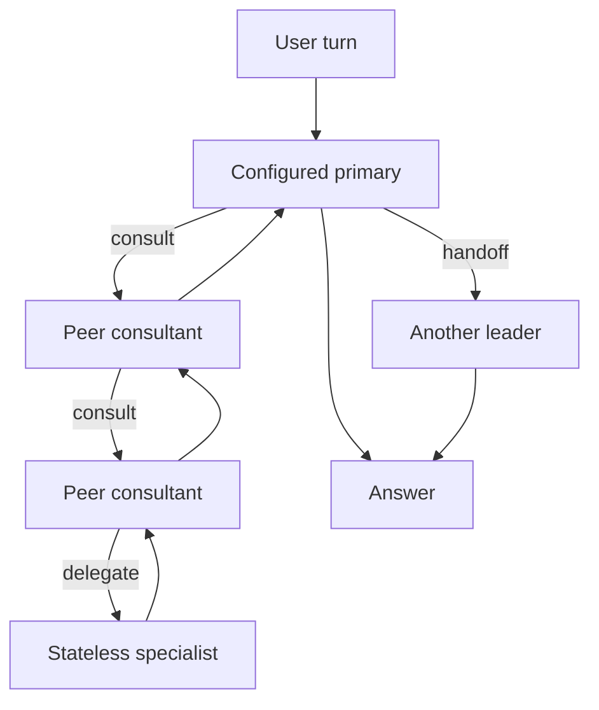

# fixer

```
 ⠀⠀⠀⠀⠀⠀⣠⣾⣿⣿⣿⠀⠀⠀⠀⠀⠀⠀⠀
 ⠀⠀⠀⠀⠀⢰⣿⡿⠀⠀⠀⠀⠀⠀⠀⠀⠀⠀⠀
 ⠀⠀⠀⣠⣶⣿⣿⣷⣶⡶⣶⣶⣆⠀⠀⠀⣴⣶⣶⠆
 ⠀⠀⠀⠉⢹⣿⣿⠉⠉⠀⠘⢿⣿⣧⣀⣾⣿⡿⠃⠀             Tiny, open, embeddable, native coding agent.
 ⠀⠀⠀⠀⣼⣿⡏⠀⠀⠀⠀⠀⠻⣿⣿⣿⠟⠀⠀⠀
 ⠀⠀⠀⢀⣿⣿⠃⠀⠀⠀⠀⢠⣦⠘⢿⣿⣷⡀⠀⠀             zig build -Doptimize=ReleaseSafe
 ⠀⠀⠀⣸⣿⡟⠀⠀⠀⠀⣰⣿⣿⠗⠀⠻⣿⣿⣄⠀
 ⠀⠀⠀⣿⣿⠇⠀⠀⠀⠾⠿⠿⠋⠀⠀⠀⠘⠿⠿⠦             ⚠ Status: Experimental. Use at your own risk.
  ⠀⣸⣿⡿⠀⠀⠀⠀⠀⠀⠀⠀⠀⠀⠀⠀⠀⠀⠀
 ⣿⣿⣿⠟⠀⠀⠀⠀⠀⠀⠀⠀⠀⠀⠀⠀⠀⠀⠀
```

fixer is a fork of [vercel-labs/fx](https://github.com/vercel-labs/fx) with ALT's recursive multi-model Team orchestration bundled as a first-class, replaceable extension.

fx remains the harness. Its terminal UI, model clients, credentials, permission engine, tools, filesystem access, process execution, and persistence infrastructure remain native. ALT owns only Team definitions, leadership, consultations, specialist projections, bounded orchestration context, and the rules by which results return.

**Development status:** ALT is experimental but usable through a native guided Team library. It creates, selects, revises, starts, and deletes immutable Teams without exposing their stored JSON documents. Every ALT session is pinned to the exact Team revision that created it and remains resumable after later revisions or deletion.

ALT is compiled into normal fixer builds, but **ALT mode is not active when the application starts**. fixer opens in native fx. `/alt` resumes the latest ALT session when one exists and opens the Team library on a fresh installation, `/resume` identifies ALT sessions by their pinned Team revision, and `/alt off` returns to a native fx session.

The underlying harness remains optimized for research and embeddability as part of larger systems.

It focuses on minimalism and performance across the board, from system prompt design to its tools, feature set, and compact native binary.

For end users, its CLI output style and form factor aim to be closer to a Unix shell than a heavy "IDE in the terminal" TUI.

It's open source (Apache-2.0), model-agnostic, and suitable for both local and cloud inference.

## Build and run

Building fixer requires [Zig 0.16.0+](https://ziglang.org/download/):

```bash
git clone https://github.com/ALT-Infra/fixer.git
cd fixer
zig build -Doptimize=ReleaseSafe
./zig-out/bin/fx
```

ALT-Infra intentionally publishes no fixer release tags or prebuilt releases. Clone the repository and build the current source.

## Run fx

Sign in with Vercel AI Gateway:

```bash
fx login
```

Or use an eligible ChatGPT subscription through OpenAI Codex OAuth:

```bash
fx login codex
fx
```

Or use an eligible Grok subscription through xAI OAuth:

```bash
fx login grok
fx
```

Or select OpenCode immediately for its anonymous free Zen models:

```bash
fx provider opencode
fx
```

An OpenCode API key adds the paid Zen and Go catalogs:

```bash
export OPENCODE_API_KEY=<your-opencode-api-key>
fx login opencode
fx
```

Or sign in to your Cline account in the browser. No API key is required:

```bash
fx login cline
fx
```

`CLINE_API_KEY` remains an optional non-interactive alternative:

```bash
export CLINE_API_KEY=<your-cline-api-key>
fx login cline
fx
```

`fx login codex` and `fx login grok` select that provider and a model from its authenticated catalog; `fx login opencode` and `fx login cline` do the same for OpenCode and Cline. Inside fx, run `/provider` (alias `/setup`) to move between Gateway, Codex, Grok, OpenCode, and Cline: Enter on a provider switches to it or starts its sign-in, and `vercel` opens further columns for the sign-in method, the API key to use, and the Vercel team. `/model` lists the active provider's fetched models. Subscription model IDs are the raw IDs returned by each authenticated catalog. Model discovery continues when its local version cache is unusable. Use `/logout codex`, `/logout grok`, `/logout opencode`, or `/logout cline` to remove that saved provider session. Logging out of the active subscription switches to an already-connected provider, preferring Gateway and then the other subscription. If none is usable, fx stays signed out. Logging out of an inactive subscription keeps the active provider unchanged. Active subscription logout is unavailable while work is active or queued; choosing the provider again from `/provider` starts sign-in.

If a saved credential cannot be checked, `/login`, `/provider`, and `/setup` still open and identify the unavailable source. You can type the provider name immediately after Enter; credential checks preserve your input and keep choices unavailable until checking finishes. Provider and team preparation also keeps typing and cancellation responsive while its catalog loads. Ctrl+C cancels preparation without changing the current provider. A prompt submitted during preparation waits for the selected provider; if preparation fails, the prompt stays pending for explicit recovery. While responses are active or queued, these commands immediately explain that provider switching is unavailable. Other credentials remain usable. Fix the saved credential and reopen `/provider` to retry. Storage or connection failures do not start another sign-in, and browser authorization reports success only after the new credential is saved.

If credential storage fails when you submit a prompt, fx keeps the prompt and the selected account. Repair the saved credential, then press Enter to retry. A sign-in that cannot save its credential reports a storage failure. Resumed sessions restore their provider's credential and model catalog before the first prompt.

The OpenAI Codex route uses ChatGPT subscription access directly and never sends its OAuth token to Vercel AI Gateway. The session is stored privately at `~/.fx/chatgpt-auth.json` and refreshed when needed. On supported Codex models, `/fast` requests OpenAI's priority service tier and consumes ChatGPT credits at the higher Fast mode rate.

The Grok route uses subscription access directly at xAI and never sends its OAuth token to Vercel AI Gateway or OpenAI. Its session is stored privately at `~/.fx/grok-auth.json`, refreshed when needed, and used only with the authenticated xAI catalog and Responses API.

Without a key, OpenCode exposes only the free models from its live Zen catalog and requests carry no authorization header. `fx login opencode` imports `OPENCODE_API_KEY` into a private copy at `~/.fx/opencode-auth.json`; that expands the picker to compatible paid Zen and Go models. Later commands use the saved copy, so `fx logout opencode` removes paid access while leaving anonymous free Zen access usable. The OpenCode route sends the saved key only to OpenCode. fx discovers availability from OpenCode's live catalogs and uses the live provider metadata maintained by OpenCode's models.dev project to select models served through OpenAI-compatible Chat Completions. New compatible models therefore appear without an fx release, while models explicitly assigned to OpenAI Responses, Anthropic Messages, or Gemini protocols remain hidden until fx supports those transports. Go model IDs use the `go/<model-id>` prefix in fx.

`fx login cline` starts Cline's browser device authorization, registers the grant with Cline, and stores the resulting refreshable account session privately at `~/.fx/cline-account-auth.json`. If `CLINE_API_KEY` is present, the same command instead imports it into `~/.fx/cline-auth.json` for non-interactive setups. `fx logout cline` removes both forms. fx reads the current model tiers directly from Cline's live recommended-models feed: signed-in users see free models, and ClinePass models appear only when Cline's account endpoint confirms a current plan. The list is not compiled into fx, so Cline can add or retire models without requiring an fx release.

### Web search through Parallel

Gateway, Codex, and Grok models search through their own native routes. Models without native search (including OpenCode and Cline) borrow [Parallel](https://parallel.ai/) when it is configured, so `web_search` stays available everywhere:

```bash
export PARALLEL_API_KEY=<your-parallel-api-key>
fx login parallel
```

`fx login parallel` imports `PARALLEL_API_KEY` into a private copy at `~/.fx/parallel-auth.json`; the session is stored at that path and `fx logout parallel` removes it. Searches default to the low-latency `fast` mode; the model may pass focused `search_queries` (at most five) and request `advanced` depth for genuinely multi-hop research. Parallel sizes its LLM-optimized excerpts for the objective and active model instead of receiving a fixed character budget from fx. When a result is a promising lead, `web_fetch` can send Parallel a focused objective for relevant excerpts or omit the objective to request the complete page. Related search and fetch calls share one task-scoped Parallel session. Searches and extracts never send your API key anywhere except Parallel.

Codex and Grok discover current stable client versions from upstream release metadata without requiring either CLI to be installed. fx caches release metadata for one minute. Opening `/model` or requesting ACP model options refreshes an expired subscription catalog. If a release lookup temporarily fails, fx uses the last successfully fetched version.

To use an AI Gateway API key instead:

```bash
fx setup
```

Embedding hosts that inject provider authentication at the network boundary can set `FX_AUTH_MODE=host-managed`. In this mode, fx does not read, refresh, or write local model-provider credentials and does not add authentication-owned headers to Gateway, Codex, or Grok requests. The host must authenticate those forwarded requests.

Run fx from a project:

```bash
cd your_project
fx
```

The current directory becomes the primary workspace. Enter a prompt, or run `/help` to browse interactive commands. While fx is working, you can submit a multiline update with Enter; it steers the active turn at its next safe model boundary. When no tool is running, your message appears in the transcript immediately. Updates waiting for a running tool show their first two lines with a dotted rail and an ellipsis when more text is hidden. Press Escape to interrupt the active work and apply the update as soon as the turn settles.

Use `/resume` to choose a saved conversation. The picker shares its catalog across workspace views and reuses unchanged session summaries between launches. The first catalog build, or recovery from missing cache data, scans saved sessions automatically. Changed sessions are checked again, and closing the picker stops obsolete loading work.

Tool calls are expanded by default. Enable `Collapse tool calls` in `/settings`, or set `"collapse_tool_calls": true` in `~/.fx/settings.json`, to show one summary per tool-call group in the main transcript. Individual calls remain available in the full transcript with Ctrl+O. Follow-up activity for captured shell commands shows the original command, such as `Observed zig build`, while tool results keep the same execution handle.

When a tool targets a directory with additional project instructions, fx shows `Reading project instructions before continuing:` before the agent decides whether to retry. This refresh does not add a failure or “command not run” count to the tool summary.

While fx is working, Ctrl+C clears a nonempty composer without interrupting the turn. Press Ctrl+C again with an empty composer to cancel the active work.

Ctrl+L clears the inline display while keeping the conversation available in Ctrl+O. It preserves your draft and conversation context; `/clear` starts a fresh conversation instead.

## ALT sessions

Resume the latest ALT session, or open the Team library when none exists:

```text
/alt
```

Open Team management directly, or begin a new Team in the guided builder:

```text
/alt teams
/alt new
```

The builder configures the Team name, unified provider, primary, peers, specialists, per-role model and instructions, and callable specialist authority. Team and role IDs are opaque, generated automatically, and never presented as authoring fields. Role models are chosen through fx's native live model catalog instead of typed from memory. Write each role's instructions only as that role's identity and expertise: ALT separately supplies every primary and peer with the complete peer roster and exact peer definitions. Every primary and peer can consult every other peer; specialist access is supplied separately and may be exclusive to one of them.

The Team library can start the latest revision in a new conversation, edit it as the next immutable revision in another new conversation, or remove it from the active library. Editing preserves the hidden Team identity. Removed Teams remain available through sessions that already pin one of their revisions. A Team must contain a primary and at least one peer or callable specialist; fixer does not offer a single-agent ALT preset.

Return to native fx without leaving the application:

```text
/alt off
```

Every user turn in ALT mode enters through the Team's configured primary peer. Exactly one peer holds leadership at a time and may answer, hand leadership to an authorized peer, or coordinate Team work.



The runtime enforces these boundaries:

- A consultation never transfers leadership or answers the user.
- A consultant may call any other Team peer and the specialists assigned to it.
- Nested results return only to the immediate caller and unwind one frame at a time.
- Handoffs, consultation boundaries, and specialist boundaries appear as compact native fx notices naming the source and destination catalog models.
- Context-bearing peer surfaces are serialized while unrelated child work may run concurrently.
- Specialist batches may express dependency ordering with `depends_on`.
- Specialists are clean-slate leaf calls with bounded projections, selected attachments, and fx's real tools—but no conversation or Team state.
- Every new user turn starts at the configured primary, regardless of who answered the previous turn.

Team revisions are immutable. Creating a Team starts revision 1 in a new fx conversation; editing it will create the next revision and start another conversation. Existing sessions retain their exact Team revision even after that Team is edited or removed from the active library. Native Codex, Grok, and fx subagents are unavailable inside ALT mode; `/alt off` restores the complete native fx environment.

The status line hides the workspace path and Git branch by default. Enable the `Status line workspace` option in `/settings`, run `/statusline workspace`, or set it in `~/.fx/settings.json`:

```json
{
  "statusLine": {
    "workspace": true
  }
}
```

List saved sessions with `fx sessions`. Resume the latest session for the current workspace, or select an exact session ID, through the same command group:

```bash
fx session resume last
fx session resume --id <id>
```

`fx -c` also resumes the latest session for the current workspace. It skips unrelated current-format conversation histories during selection and attempts safe recovery of the selected session after an interrupted migration. A busy or unrecoverable selected session produces an error rather than opening an older conversation.

Repeated continuation reuses validated summaries of unchanged older sessions instead of replaying their histories during selection. The first scan, or a scan after those session files change, can take longer. Opening the resume picker preserves these cached summaries.

Older sessions that saved Vercel connection settings can be opened through `-r`, `/resume`, `-c`, or an exact ID. Migration preserves their model settings and keeps unfinished responses as interrupted history, without replaying old requests or restoring saved credential references.

If a saved conversation is damaged, run `fx session recover <id>` to copy its validated prefix into a new session. Recovery preserves checkpoint boundaries and referenced result files, leaves the original unchanged, and prints the new session ID. Records after the damaged boundary are not included, and recovery does not rerun commands. If only accounting is corrupt, recovery keeps the conversation and marks historical usage as incomplete in the copy; the original accounting file remains unchanged. Healthy conversations can be resumed without recovery. Paused requests retain their captured images across errors and restarts. Continuing uses those saved images even if the original files move or change; missing or corrupted saved images produce a recovery error.

A saved session has one writer until it closes. Suspending it with Ctrl+Z keeps its lock, so another process trying to resume the same session gets `SessionBusy`. Foregrounding preserves the current conversation and draft without reloading them.

Recovery only reports that no repair is needed after confirming the saved session can be loaded. If a final session save fails during interactive shutdown, fx reports the failure and exits with a nonzero status after cleanup, without a successful resume hint or automatic upgrade relaunch.

New sessions appear in resume selection only after their initial files are ready. Incomplete creation folders left by older builds do not block healthy conversations from resuming with `-c`; those folders remain available for diagnosis and are not deleted.

Interactive terminal tabs show `fx v<version> | <folder>` using the running binary's version and current workspace folder name, for example `fx v0.0.7 | fx`. Renaming a session or switching models leaves the title unchanged. Resuming from another folder uses that folder's name. Exiting clears the fx-owned title. Noninteractive commands do not emit terminal-title controls.

Run `/feedback` to open the feedback form at `fx.sh/feedback`. It does not create a diagnostic or change the clipboard.

Run `/trace` to create a private Markdown diagnostic with logs, session context, runtime state, permissions, and recent activity. On macOS, fx copies the `.md` file to the clipboard; on other platforms, it saves the file and prints its path. Review and redact the trace before sharing it.

fx automatically summarizes a long session into a fresh context window when the active model request reaches 80% of its usable input capacity, then continues the same turn. Run `/compact` to create the same durable handoff immediately and wait for your next prompt. Manual compaction refreshes the selected login when needed; Ctrl+C cancels preparation. If authentication fails, the chat stays open and unchanged so you can reconnect and retry `/compact`.

Compaction handoffs remain internal context for the model. Resuming a session and opening its full transcript show the conversation and tool activity, not internal summaries or operation ledgers.

Saved conversations preserve original assistant replies and compatible provider continuation data. Display formatting does not rewrite saved text, and hook-driven continuation keeps earlier replies separate from the final response.

In saved sessions, oversized `read_tool_result` responses keep a complete terminal-safe backing copy even when the inline response is clipped. Compaction and later retrieval preserve that copy without masking the explicitly requested text again.

Resuming an older session upgrades its saved permissions and skips empty legacy file-change entries while keeping the conversation and tool results. Historical cache-token accounting no longer prevents an otherwise valid older session from resuming; incompatible usage totals are marked unavailable. Cancelled tools remain recorded as failures and do not prevent later compaction. If the model returns an empty compaction summary, fx retries the summary once without repeating tools. Cancellation or another failed summary leaves the previous context intact.

Use `fx ask` for a single request:

```bash
fx ask "explain the changes in this repository"
```

With `--json`, `output` contains accumulated assistant Markdown across the request. Recovery replaces failed preview text rather than joining separate responses. If recovery pauses before a replacement is accepted, `output` keeps the latest preview. `final_output` contains only a completed final assistant response and is `""` for interrupted, failed, background, or otherwise absent final responses.

JSON results also include `usage.input_tokens` and `usage.output_tokens`, even with `--no-save`. These are the sums of token counts reported by main-agent completions in the turn, not the latest prompt size or session totals. A field is `null` when no completion reported that count; when only some completions report it, the sum includes only those known counts. JSON errors retain usage already observed. These fields do not include nested tool/provider usage, request counts, or dollar spend.

Foreground terminal commands run with an explicit finite deadline. fx uses durable terminal sessions for services, watchers, GUI applications, and other long-lived work, and keeps captured foreground output available through an opaque bounded-read handle for the active session or `--no-save` process.

Invalid Shell requests return the specific argument problems before any command runs. When the intended repair is unambiguous, the error includes a `retry_with` request for the agent to submit through normal validation and permissions. Repeated equivalent corrections stop the tool loop.

fx starts in `auto` permission mode. Routine understood development actions run directly. Each unresolved action receives one narrow review of the exact pending action for concrete security danger. Prepared file mutations and static tools are reviewed without task text; reviewed commands, dynamic tools, and delegated actions also receive bounded trusted root-request context. A clear result authorizes only that action. A caution or unavailable review holds the action and returns advice to the agent without opening a permission prompt or ending the turn. See [Permissions](https://fx.sh/docs/configure-fx/permissions) for other modes and persistent rules.

Use `fx ask --full-access` or `/permissions full-access` to disable fx permission checks for trusted environments. The former `--yolo` flag and `/permissions yolo` command remain supported. `FX_PERMISSION_MODE` and profile `permission_mode` accept `full-access`; saved settings and JSON output retain `yolo` for compatibility.

JSON and quiet requests stay noninteractive by default. Add `--prompt-permissions` to allow configured approval prompts when stdin is a TTY. Automatic safety review never opens that prompt. Prompt text is written to stderr, so JSON stdout stays parseable and quiet stdout stays empty. Piped or redirected stdin remains noninteractive and fails instead of waiting for approval.

Inside a saved session, `/permissions remember <allow|deny> <tool-name> <arguments-json>` stores an exact confirmed rule without running the action. `/permissions` lists stable rule IDs, and `/permissions revoke <rule-id>` removes a stored rule even when its original workspace or file state has changed.

## Embed fx

fx builds as a native binary or WebAssembly. Applications embedding fx can provide network transport, session storage, configuration, permission handling, and terminal I/O.

| Surface | Use |
| --- | --- |
| `fx acp` | Connect the native agent to editors and other Agent Client Protocol clients. |
| `createFxAgent()` | Embed the agent core in a JavaScript host with `fx-core.wasm`. |
| `createFxTerminal()` | Embed the interactive terminal with `fx-term.wasm`. |

The WebAssembly SDK is experimental. See the [WebAssembly SDK](sdk/README.md) and [ACP documentation](https://fx.sh/docs/using-fx/acp).

## Extend fx

In the interactive shell, bare `/mcp` opens an inline browser for servers, tools, resources, and prompts without adding anything to the transcript. Resource and prompt content enters the composer only after an explicit Insert action. Direct `/mcp SUBCOMMAND` forms remain available.

Add reusable instructions with [skills](https://fx.sh/docs/capabilities/skills), connect external tools through [MCP](https://fx.sh/docs/capabilities/mcp), or delegate independent work to [subagents](https://fx.sh/docs/capabilities/subagents) in native fx. Run `fx mcp add NAME COMMAND [ARGS...]` for a local server or `fx mcp add --transport http NAME URL` for Streamable HTTP without opening the interactive shell; the equivalent `/mcp add` forms remain available inside fx. A workspace may also provide Claude-compatible `.mcp.json` with a top-level `mcpServers` object. Pending project servers stay disconnected on every surface until they are approved with `/mcp trust approve <server>` or `fx mcp trust approve <server>`. Interactive fx presents the trust prompt after startup. `fx ask` reports skipped pending servers on stderr, and ACP leaves them unavailable. Repository files cannot persist approval or expose environment-expanded values before approval. `/mcp trust reject <server>` rejects one and `/mcp trust reset` clears the workspace choices. Profile entries win same-name collisions. Profile `~/.fx/mcp.json` accepts `mcpServers` as an alias for `mcp`, while writes always use `mcp` and ambiguous server-like keys produce a visible warning. Project instruction files may link within their scope, and read-only workspace or compatibility skill directories and their primary `SKILL.md` files may link within their owning workspace or home; managed skills, secondary resources, and escaping links remain no-follow. Skills installed via symlinks that resolve outside home or workspace (e.g. Nix store paths) are loaded when their resolved target is inside a directory listed in the `FX_SKILL_SYMLINK_AUTHORITIES` environment variable (colon-separated absolute paths). `fx status` and `fx doctor` report invalid or suspicious trusted MCP profiles without starting their servers.

The `subagent` tool has two operations: `run` delegates one temporary task, and `message` creates or continues a named persistent agent. Each call waits for the child's result. A first message creates the named child immediately; optional instructions set or replace that child's system overlay while preserving fx's trusted base prompt. Child sessions remain private to their saved parent session. Each call appears in the main chat with its agent name or one-off status and a short task preview; full requests and replies remain in the tool details.

Failed calls include the captured failure reason and any partial result, including HTTP failures before an answer or after earlier tool calls. Earlier tool effects are not rolled back or automatically retried. Existing child records remain readable, but records saved by this version cannot be reopened by older binaries that only support child registry schema 1.

Run `fx mcp` to see the available commands. Use `fx mcp list`, `fx mcp path`, and `fx mcp remove NAME` for noninteractive profile management. `fx mcp trust approve|reject NAME`, `fx mcp trust approve-all`, and `fx mcp trust reset` manage workspace-scoped project trust. `fx mcp auth NAME` and `fx mcp logout NAME` run the existing remote credential lifecycle without opening the TUI or contacting the Gateway.

MCP servers have a 30-second startup timeout by default; set `startup_timeout_ms` on a server when its cold start needs a different bound. For direct `docker run` stdio entries, fx uses a private container ID file to remove the owned container after shutdown or startup failure. A configuration that already supplies `--cidfile` keeps ownership of its own cleanup policy.

Native MCP connections use the standard `initialize` handshake by default,
negotiating the supported 2025 and 2024 protocol versions. Servers that require
the newer `2026-07-28` discovery lifecycle can opt in with
`FX_MCP_PROTOCOL_VERSION=2026-07-28` in their configured `environment` map.
The SDK's host-owned client controls its own protocol negotiation.

MCP servers connect independently. In headless asks, a request for one server starts
that server without starting unrelated optional servers. Capability search loads
matching tool definitions automatically; explicit `mcp_select_tool` remains
available. The server validates its tool arguments. Image results reach supported
models as images and remain available in saved sessions; text-only models receive
an explicit notice.

Skills are advertised in a stable catalog sized to the selected model's context window. The default budget is approximately 2% of context, or 8,000 characters when the context size is unknown, with up to 1,024 characters per description. Explicit byte overrides take precedence. When space is limited, fx shortens descriptions before omitting skill identities; `capability_search` can find skills outside that catalog.

Explicit `$skill-name` mentions load the selected instructions before the model starts work. The `skill` tool accepts an advertised `location` and an optional relative `resource`, returning the complete document or a visible failure. Omitting `resource` or passing an empty string reads `SKILL.md`. File and tool-result limits still apply, and an explicit `skill_chunk_bytes` limit blocks a complete read that would exceed it. Existing named, offset-based calls remain supported.

In the interactive shell, explicitly requested skills show a named load summary before the assistant replies. Full failure details are available in Ctrl+O. These automatic loads are not counted as tool calls; a loaded status confirms prepared instructions, not that the model followed them.

## Documentation

Read the [fx documentation](https://fx.sh/docs).

## Build modes

The normal build selects the bundled ALT implementation but does not activate its mode at startup:

```bash
zig build -Doptimize=ReleaseSafe
```

Build the harness without ALT or any orchestration extension:

```bash
zig build -Doptimize=ReleaseSafe -Dorchestration=none
```

Build against another implementation of the generic host contract:

```bash
zig build \
  -Doptimize=ReleaseSafe \
  -Dorchestration=custom \
  -Dorchestration-root=/absolute/path/to/extension.zig
```

Passing `-Dorchestration-root` by itself is retained as shorthand for the custom mode.

Run the full Zig suite with `zig build test`. Run the paired ALT host suite with `zig build test-orchestration-extension -Dtarget=x86_64-linux-musl`. Crucible also builds the product and drives its real TUI through a PTY with deterministic provider fixtures:

```bash
zig build crucible-host \
  -Dtarget=x86_64-linux-musl \
  -Dbun=/absolute/path/to/bun
```

The bundled implementation lives under `alt/`; the ALT-agnostic host contract and lifecycle infrastructure remain under `src/core/orchestration/`. See [CONTRIBUTING.md](CONTRIBUTING.md) for development and contribution guidelines.

## License

[Apache-2.0](LICENSE)

Third-party licenses and attributions are listed in
[THIRD_PARTY_NOTICES.md](THIRD_PARTY_NOTICES.md).

## Credits

Interface sounds by [cuelume](https://github.com/Danilaa1/cuelume).
